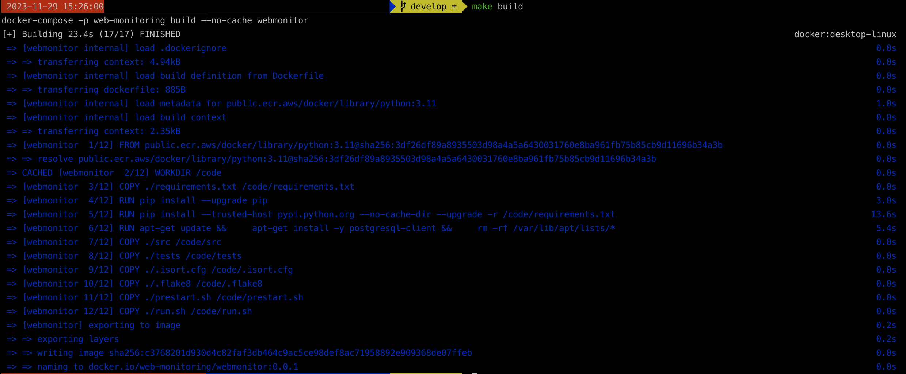
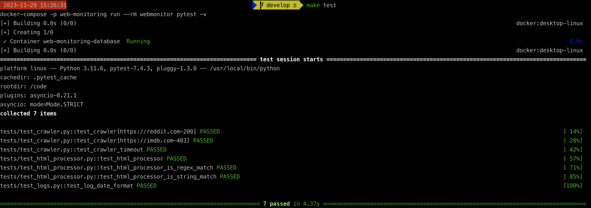
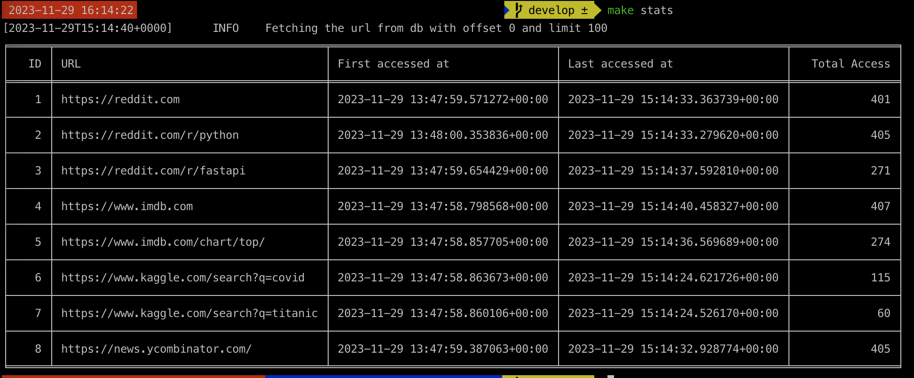

# Web Monitoring with Python

## Description

This is a Python application that monitors a website and logs the access results into a database.

Each site has its own entry in the database and this entry contains the following information:

- Title
- Description
- URL
- Access Interval in seconds
- A regex pattern to match against the response body

The database schema for the links and link access logs table can be found in [./webmonitor/src/database/schemas.sql](./webmonitor/src/database/schemas.sql) file.

The scheduling operation is being handled with a simple approach. This approach is not the best approach but it is simple and it works. The approach is as follows:

- The application starts and collects all available links from the database.
- For each link, a task is created with the link `url` and `access_interval` information.
- Each task runs in a separate thread and it makes a request to the `url` and checks the response body against the regex pattern.
- The results of the crawler is written to the database.
- The task sleeps for the time which is the difference between the `access_interval` and the time it took to make the request.
- After the sleep, the task is executed again and the process continues.

## Requirements

The application is built using Python 3.11.6 and the required libraries listed in the [requirements.txt](./webmonitor/requirements.txt) file.

Since the application is containerized, the only requirement is to have `docker` and `docker-compose` installed on your system.

## Configuration

The application is configured using environment variables. The following environment variables are used:

| Variable Name     | Description                             | Default Value  |
| ----------------- | --------------------------------------- | -------------- |
| PROJECT_NAME      | The project name                        | web-monitoring |
| PROJECT_VERSION   | The project version                     | 0.0.1          |
| POSTGRES_VERSION  | PostgreSQL version (only for local run) | 15.5           |
| POSTGRES_HOST     | Database hostname (docker db container) | localhost      |
| POSTGRES_PORT     | Database port for local run port        | 5432           |
| POSTGRES_USER     | Database username                       | admin_admin    |
| POSTGRES_PASSWORD | Database password                       | N/A            |
| POSTGRES_DB       | Name of the database to connect         | webmonitoring  |
| DEBUG             | Debug flag (True \| False)              | True           |

> ⚠️ This variables for local run should be set in [.env](.env) file. The file should be copied either from [.env.local](.env.local) and should be updated accordingly.
>
> ⚠️ The variables for the local run with local database container should be set in [.env.local](.env.local) file. The file is added to the repo for demonstration purposes.
>
> ⚠️ In this file, the `POSTGRES_PASSWORD` variable is set to `N/A` for security reasons. This variable should be set to the actual password for the database.

## Running the application

### Makefile

A [Makefile](./Makefile) is added to the repo in order to make the build, run and testing easier by wrapping the docker and docker-compose commands. To be able to use Makefile, you need to have `make` installed on your system.

> ⚠️ Please make sure that `.env` file is created and updated according to the notes above.

The following commands are available:

| Command      | Description                                                     |
| ------------ | --------------------------------------------------------------- |
| `make help`  | Display the help menu with available commands                   |
| `make build` | Builds the docker image for `webmonitor` (with no-cache option) |
| `make run`   | Runs the docker containers (`webmonitor` and `database`)        |
| `make test`  | Runs the tests                                                  |
| `make stop`  | Stops the docker containers (app and database)                  |
| `make clean` | Removes the docker image                                        |
| `make stats` | Displays the stats for the links                                |

## Simple client script to check stats of the links

There is a simple client script ([cli.py](./webmonitor/src/cli.py)) that can be used to check the links and some stats about the links (such as `first access`, `last access`, `number of access`) in the database.

The script can be run using the following command with Makefile after the service is up and running (`make run`):

```bash
$ make stats
```

Alternatively, it can be run with `docker exec` command after the docker containers are up and running :

```bash
docker exec -it web-monitoring-webmonitor python src/cli.py --offset 0 --limit 100
```

### Example outputs for Makefile command

- `make build`



- `make test`



- `make stats`



## Future work

### What needs to be done?

- [ ] Check aiohttp library for asynchronous requests and its session. Session can be used as singleton to avoid creating a new session for each request.
- [ ] Sanitization of the database inputs (such as title, description, url, etc.) to avoid SQL injection.
- [ ] Test coverage check should be added like `flake8` and `black` checks by using `pytest-cov` library.
- [ ] For production, the application should be split into 2 separated application using the same database:
  - [ ] One for scheduling the tasks regularly and
  - [ ] One for crawling the links

### What needs to be done better?

- [ ] Improve task scheduling by using more sophisticated scheduler logic:
  - [ ] With a queue system (such as RabbitMQ, Redis, Kafka, etc.) and 2 separated services (one for scheduling and one for crawling)
  - [ ] With a more sophisticated scheduler (such as Celery)
- [ ] Error logging should be improved by redirecting the logs to the file or to a log management system.
- [ ] Add more tests to increase the code coverage
- [ ] Add more logging for debugging purposes
- [ ] Add more exception for different cases
